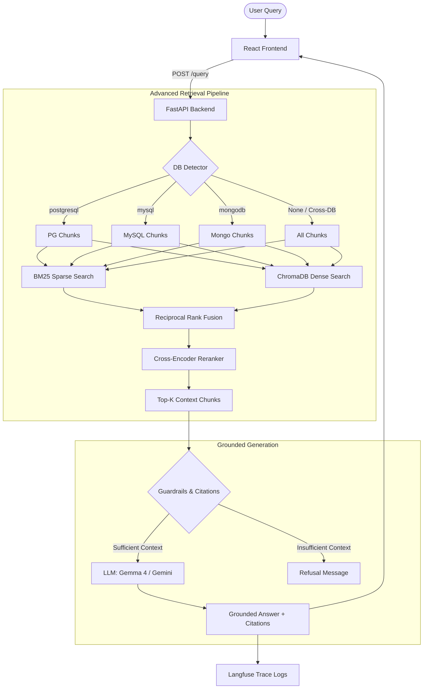

# ⚡ DBrain Performance RAG — Technical Co-Pilot

A production-grade, metrics-driven, and CI-gated **Retrieval-Augmented Generation (RAG)** system that provides verified, citation-backed performance optimization answers over **PostgreSQL**, **MySQL**, and **MongoDB** official documentation.

This project serves as **Module 7 (Chat Interface & RAG)** for **DBrain**—an AI-powered database performance co-pilot. It is designed to act as a production-grade portfolio piece, featuring hybrid retrieval, cross-encoder reranking, observability tracing, and automated quality evaluation gates.

---

## 🏗️ System Architecture



---

## 🛠️ Tech Stack & Key Concepts

| Component | Technology | Role / Explanation |
|---|---|---|
| **Frontend** | React, TypeScript, Axios | Premium dark-themed performance dashboard UI with database filter tabs, precise latency telemetry, and query cards. |
| **Backend** | Python, FastAPI | High-performance API hosting the search, query, health, stats, and telemetry metrics endpoints. |
| **Vector Store** | ChromaDB | Local dense vector database storing document chunks for semantic search. |
| **Embeddings** | HuggingFace (`all-MiniLM-L6-v2`) | Embeds chunks and query sentences into 384-dimensional vectors. |
| **Sparse Search** | Rank-BM25 | Handles keyword matching (e.g. searching for exact function or table names like `pg_stat_statements`). |
| **Fusion (RRF)** | Reciprocal Rank Fusion | Mathematical blending of BM25 and ChromaDB rankings to combine keyword and intent relevance. |
| **Reranker** | Cross-Encoder (`ms-marco-MiniLM-L-6-v2`) | Computes deep transformer attention scores between queries and retrieved chunks, filtering the top results. |
| **LLM Provider** | **Dynamic**: Ollama (`gemma4:12b`) / Google Gemini | Runs local Ollama `gemma4:12b-it-qat` by default to avoid quota limits, but falls back to Google Gemini in CI/CD and production. |
| **Observability** | Langfuse SDK / OpenTelemetry | Traces spans, token usage, latency breakdowns, and prompt inputs/outputs. |
| **Evaluation** | RAGAS Framework | Computes metric scores for Faithfulness, Answer Relevancy, and Context Precision. |
| **CI/CD** | GitHub Actions | Automatically builds index, executes tests, and gates pull requests on RAGAS score targets. |

---

## 🚀 Key Features Done So Far

1. **Aesthetic & Professional UI:** A dark/black theme designed with modern typography (`Plus Jakarta Sans` & `JetBrains Mono`), smooth transitions, responsive grid dashboard layout, and real-time query performance monitoring (Latency, Retrieved vs. Used chunks, Rerank Scores, and Routing).
2. **Database Query Routing:** Scans queries for structural database keywords (e.g., `vacuum` -> PostgreSQL, `innodb` -> MySQL, `aggregation pipeline` -> MongoDB). If a specific database is detected, the search is scoped exclusively to that database's official documentation to eliminate cross-talk and improve retrieval precision.
3. **Zero-Hallucination Guardrails:** If the cross-encoder scores of all retrieved context chunks fall below a relevance threshold (e.g. `0.15`), the pipeline triggers a guardrail that returns: *"I cannot answer this question based on the available documentation. The retrieved context does not contain sufficient information."*
4. **Exact Citations:** The prompt forces the LLM to output a dedicated `Sources:` section and append specific references (`[Source: filename (Database)]`) after every factual claim.
5. **Hybrid Retrieval (Dense + Sparse):** Blends vector dense embeddings with BM25 keyword matching using Reciprocal Rank Fusion (RRF) to ensure exact keyword matches (e.g. `pg_stat_statements`) are retrieved alongside semantic intent.
6. **Cross-Encoder Reranking:** Integrates `sentence-transformers` Cross-Encoder to evaluate the candidate context chunks against the user's query, outputting a precise relevance score.
7. **Production Observability & Tracing:** Implements full Langfuse dashboard integration to log token usage, execute traces, track latency across retrieval/reranking/generation phases, and run automated evaluations.

### 📊 Observability Tracing Screenshots

#### Trace Latency Overview
Shows request execution flow, token counts, and API response latencies inside the Langfuse console:


#### Request Span Analysis
Detailed breakdown of execution stages: Retrieval, Reranking, and Generation token usages:


#### Prompt Verification & Outputs
Verifies system instructions, injected context blocks, and generated citations matching the target docs:


---

## 🧹 Housekeeping: Redundant Files
To keep the workspace clean and optimize disk space, the following directories are **not necessary** and can be safely removed:
*   `chroma_db/`: Redundant vector store folder (active database is configured to `./chroma_db_local` in the `.env`).
*   `chroma_db_v2/`: Redundant vector store folder.
*   `LangChain/`: Local experimental directory containing tutorial scripts (`chain_string_output_parser.py`, `pydentic_output_parser.py`, etc.). The actual production RAG is implemented inside `backend/`.

---

## 💻 Local Setup & Execution

### 1. Prerequisites
Ensure you have the following installed:
*   [Python 3.10+](https://www.python.org/)
*   [Node.js 18+](https://nodejs.org/)
*   [Ollama](https://ollama.com/) (For local LLM execution)

### 2. Environment Configuration
Create a `.env` file in the root directory:
```env
GOOGLE_API_KEY="your_gemini_api_key"
LANGFUSE_SECRET_KEY="your_langfuse_secret_key"
LANGFUSE_PUBLIC_KEY="your_langfuse_public_key"
LANGFUSE_HOST="https://cloud.langfuse.com"
CHROMA_PERSIST_DIR="./chroma_db_local"
DOCS_DIR="./data/db_docs"
USE_OLLAMA="true"
```

### 3. Run Ingestion and Indexing
Download the documentation corpus, build the vector store database, and compile the BM25 sparse index:
```powershell
# Create virtual environment and install backend requirements
python -m venv venv
venv\Scripts\activate
pip install -r requirements.txt

# Run crawler & ingest scripts
python scripts/download_corpus.py
python backend/ingest.py
python backend/vectorstore.py
python backend/hybrid_retrieval.py
```

### 4. Pull and Run the Local LLM
Open a terminal and download/verify the local model:
```powershell
# Pull the Gemma 4 12B instruction-tuned model
ollama pull gemma4:12b-it-qat
```

### 5. Start the Services
Run the FastAPI backend:
```powershell
uvicorn backend.main:app --host 0.0.0.0 --port 8000 --reload
```

In another terminal, start the React frontend:
```powershell
cd frontend
npm install
npm start
```

---

## 📊 Run Evaluations

To run evaluation on the golden Q&A dataset (e.g. testing only 1 question to verify behavior quickly):
```powershell
# Set environment limit and run evaluation
$env:EVAL_LIMIT="1"
python eval/run_eval.py mysql
```
*Note: Due to CPU inference speeds, a single local RAGAS evaluation can take 3-5 minutes, as RAGAS runs multiple diagnostic LLM steps sequentially.*

---

## 🔬 GitHub Actions CI Gate

The repository has an integrated GitHub Actions workflow `.github/workflows/eval.yml`. Every time you push a commit or open a pull request:
1. The runner downloads the corpus and builds the database.
2. It sets up the dynamic LLM model (falling back to **Gemini API** because Ollama is not present in standard GitHub runners).
3. It runs the full RAGAS evaluation suite.
4. If the aggregate Faithfulness or Relevancy scores drop below the required threshold, the CI pipeline fails, gating regressions from entering the `main` branch.
